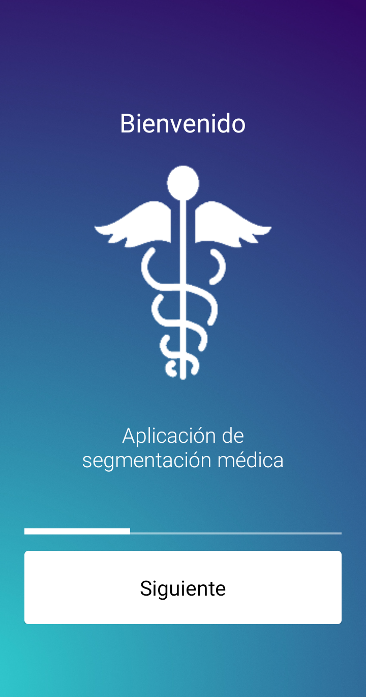
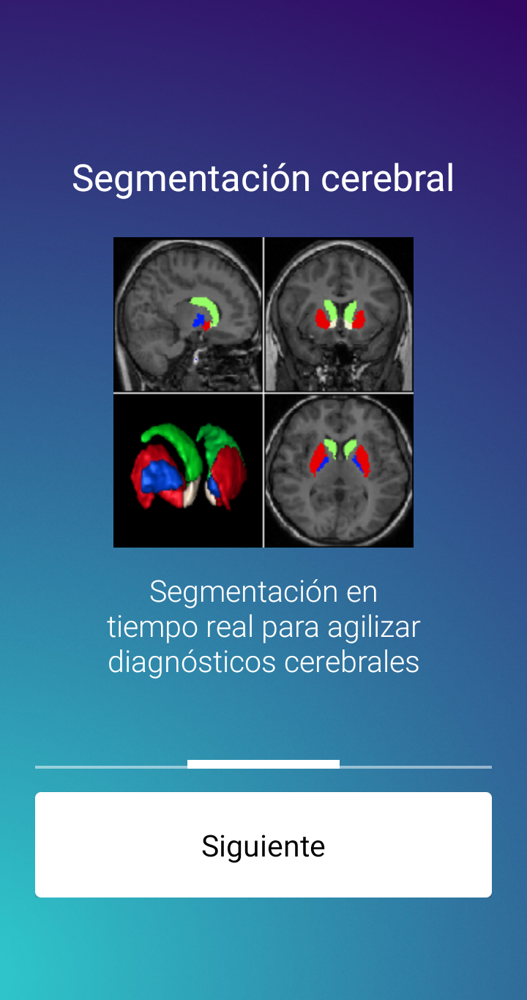
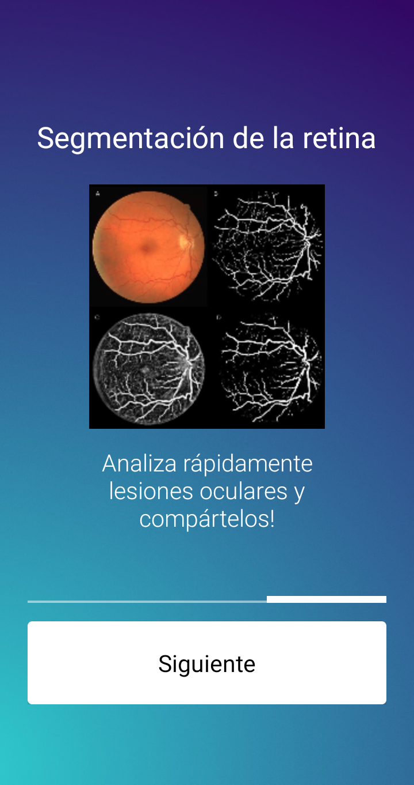
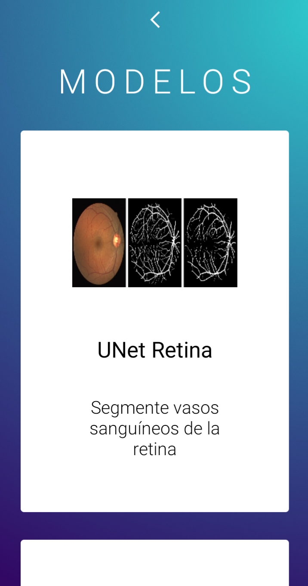
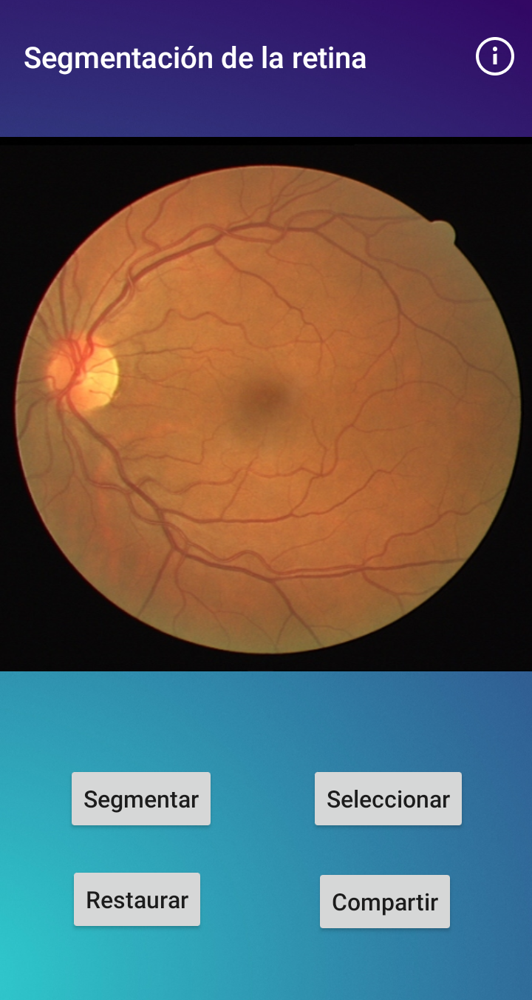
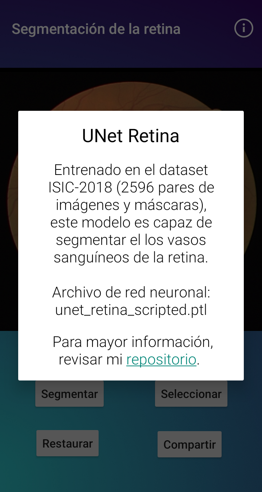
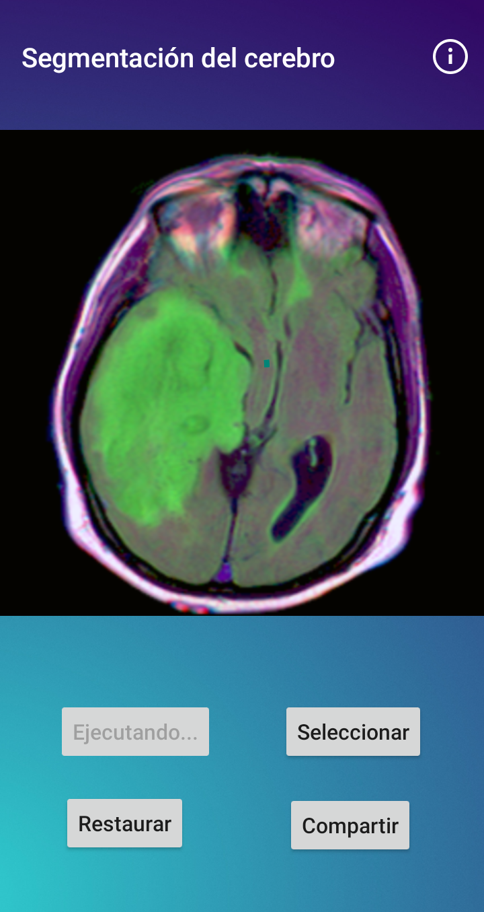
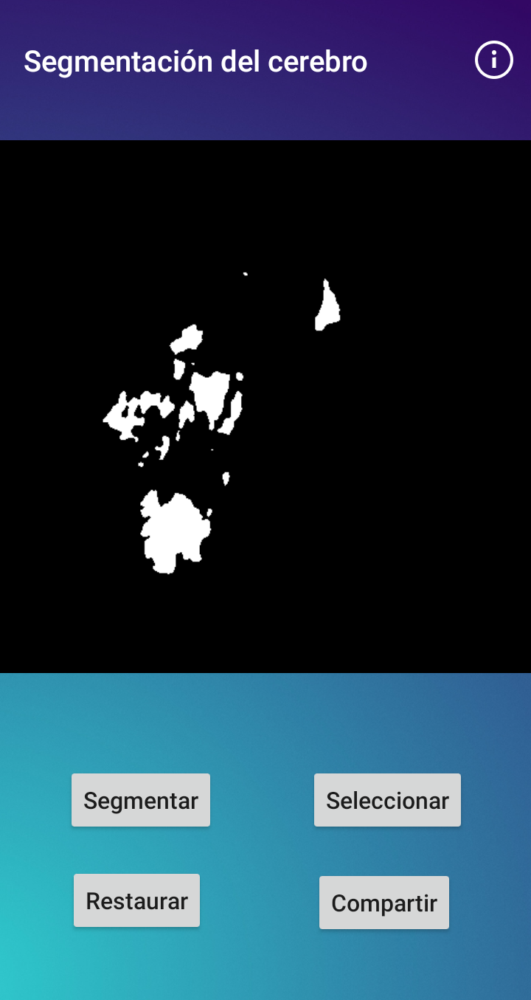
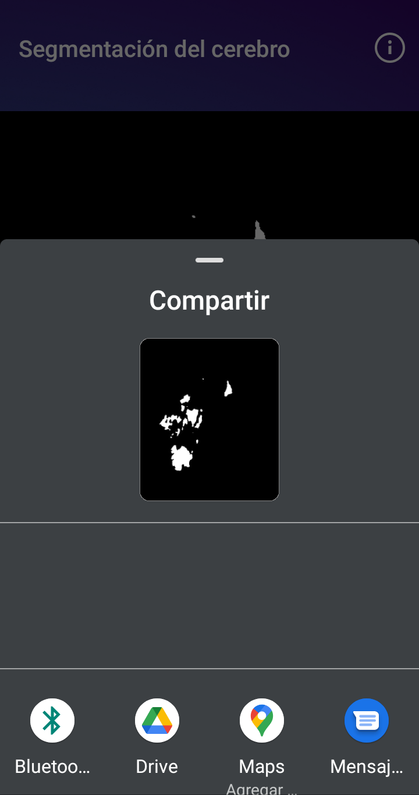
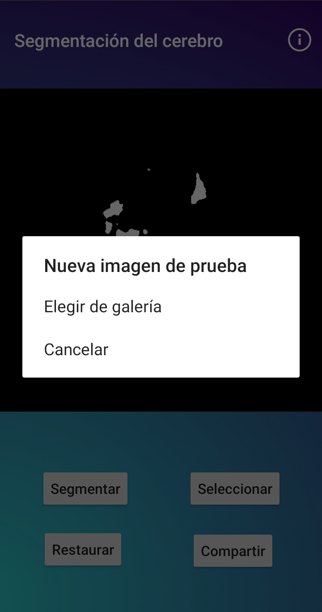

# Segmentación de vasos sanguíneos de retina usando UNET (App)

<p align="center">
  
</p>

## Motivación

Tanto la creación y entrenamiento del modelo, asi como el diseño de la aplicación fueron procesos muy interesantes, mostrándonos de una forma desafiante como podríamos abordar problemas del mundo real con ayuda de diversas herramientas de Deep Learning.

## Features

- ☕ Interfaz creada con [Java](https://developer.android.com/studio/write/java8-support?hl=es-419).
- 🔥 Modelos construidos con [PyTorch](https://github.com/uniMedic/uniMedic-Models).

## Pantallas

#### Bienvenida

<p align="center">
  
  
  f
</p>


#### Pantalla principal

<p align="center">
  
</p>

#### Modelo de segmentación de la retina


<p align="center">
  
  
</p>

#### Modelo de segmentación del cerebro

<p align="center">
  
  
  
</p>

<p align="center">
  
</p>


## Instrucciones de uso

## Clonación del repositorio

Empiece por clonar el repositorio de este proyecto:

```bash
git clone https://github.com/HiroForYou/Retina-Blood-Vessel-Segmentation.git
```

Y posteriormente ábralo en Android Studio.

## Pesos de la red neuronal

Descargue los pesos de la red neuronal y colóquelos en la carpeta `app/src/main/assets`: 
* [unet_retina_scripted.ptl](https://drive.google.com/file/d/17xxlJjE_kn47KgVCce4XSux-h91g8ibB/view?usp=sharing)
* [unet_brain_scripted_optimized.ptl](https://drive.google.com/file/d/1cJ65qvAC3BjBKMRzNaS39kJArvRJY4IJ/view?usp=sharing)

Y eso es todo! Conecte su dispositivo y comience a probar la aplicación.