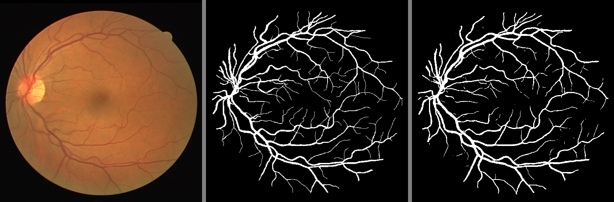
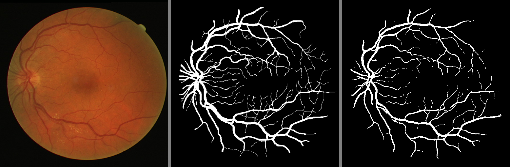

# Segmentación de vasos sanguíneos de retina usando UNET (Modelo)

Este repositorio contiene el código para la segmentación semántica del vaso sanguíneo de la retina en el conjunto de datos DRIVE utilizando la arquitectura UNET en PyTorch.

# Arquitectura
El diagrama de bloques de la arquitectura UNET fue tomado del paper original.

|  |
| :--: |
| *Arquitectura U-Net* |

## Pesos de la red neuronal
Descargue los pesos de la red: [checkpoint.pth](https://drive.google.com/file/d/1Wl7-E6Tk3YpeJ7GIYScGvUeW9ou474yy/view?usp=sharing)

# Resultados
Las siguientes imágenes contienen:
1. Imagen de entrada
2. Máscara original
3. Máscara predicha

|  |
| :--: |
|  |
|  |
|  |